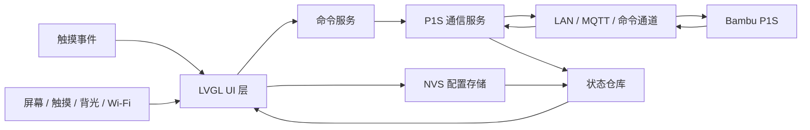

# Bambu Panel 软件系统设计

日期：2026-05-24

## 目标

Bambu Panel 的软件系统运行在 ESP32 上，为 800x480 电容触摸屏提供拓竹 P1S 主控制屏体验。系统采用局域网直连打印机的方式，不依赖云端或外部中转服务器。

第一版目标是稳定完成这些能力：

- 连接 P1S 并持续接收打印机状态。
- 显示首页、文件、控制、AMS、维护、设置等一级页面。
- 支持暂停/继续、停止、灯光、温度、风扇、速度、流量等控制命令。
- 支持 2 台 AMS、8 个料槽的状态展示和基础操作入口。
- 在离线、错误、命令失败、可选数据缺失时给出明确 UI 状态。

## 架构路线

采用“分层单固件架构”：

- 单个 ESP32 固件完成 UI、网络通信、打印机状态、命令发送和本地配置。
- UI 层不直接访问打印机协议，只通过命令服务发起动作。
- 打印机状态统一进入状态仓库，页面从状态仓库读取并刷新。
- 协议细节封装在打印机通信模块内，避免污染 UI 代码。

不采用第一版外部中转服务器方案。Home Assistant、树莓派或小主机可以作为后续扩展，但不是第一版依赖。

## 总体结构



## 固件目录建议

```text
firmware/esp32/
  CMakeLists.txt
  sdkconfig.defaults
  main/
    app_main.c
    app_context.h
  components/
    board_support/
      board_profile.*
      display_profile.*
      display_driver.*
      touch_driver.*
      backlight_driver.*
      wifi_manager.*
    bambu_ui/
      ui_app.*
      ui_theme.*
      ui_nav.*
      screens/
      widgets/
    bambu_state/
      printer_state.*
      ui_state.*
      app_events.*
    bambu_printer/
      printer_client.*
      printer_parser.*
      printer_connection.*
    bambu_commands/
      command_service.*
      command_types.*
    bambu_config/
      config_service.*
      config_schema.*
  assets/
    fonts/
    icons/
```

## 模块职责

### `board_support`

负责硬件和系统基础能力：

- 初始化屏幕、触摸、背光。
- 初始化 Wi-Fi 并维护连接状态。
- 提供屏幕亮度设置接口。
- 隔离具体开发板、屏幕驱动、触摸芯片差异。

UI 和业务逻辑不直接依赖具体引脚或驱动细节。

## 开发板与屏幕适配

第一版以 800x480 横屏电容触摸设备为主目标，但软件结构需要预留其他 ESP32 开发板和其他横屏分辨率。

### Board Profile

`BoardProfile` 描述具体开发板和硬件连接方式：

```text
BoardProfile
  board_id
  chip: esp32 | esp32_s3 | esp32_p4
  has_psram
  flash_size
  display_bus: rgb | spi | mipi
  display_pins
  touch_chip
  touch_pins
  backlight_pin
  default_display_profile
```

用途：

- 隔离不同 ESP32 开发板的引脚、屏幕总线、触摸芯片和背光控制。
- 让 UI、打印机通信、状态模型不依赖具体板卡。
- 新增开发板时优先新增一个 profile，而不是修改业务代码。

建议目录：

```text
components/board_support/
  boards/
    esp32_s3_800x480_rgb/
    custom_esp32_s3_800x480/
  board_profile.*
```

### Display Profile

`DisplayProfile` 描述屏幕尺寸和 UI 布局参数：

```text
DisplayProfile
  profile_id
  width
  height
  orientation
  dpi_class
  topbar_height
  nav_width
  page_padding
  gap
  min_touch_target
  font_small
  font_body
  font_title
  font_number
  supports_dense_ams_view
```

用途：

- 避免 UI 代码里散落硬编码坐标。
- 将导航栏宽度、顶部栏高度、间距、字体、触摸目标尺寸集中管理。
- 支持未来增加 1024x600、1280x720 等横屏设备。

第一版主 profile：

```text
800x480_landscape
  width: 800
  height: 480
  topbar_height: 48
  nav_width: 88
  page_padding: 14
  gap: 12
  min_touch_target: 44
```

### 分辨率策略

- 第一版只承诺完整支持 800x480 横屏。
- UI 代码不直接写散落的绝对坐标，页面布局从 `DisplayProfile` 读取关键尺寸。
- 组件内部可以使用局部固定尺寸，但必须来自 token 或 profile 常量。
- 800x480 以下分辨率不作为第一版目标，因为主控制屏信息密度较高。
- 1024x600 是优先扩展分辨率，布局可以在现有结构上自然放大。
- 每新增一种分辨率，必须增加截图回归验证。

### UI 适配边界

不同分辨率不要求完全同版式：

- 800x480：左侧导航 + 双栏首页，是第一版标准版式。
- 1024x600：保留左侧导航，允许增加任务详情和 AMS 信息密度。
- 480x320：如果未来支持，应设计为简化版快捷屏，而不是完整主控制屏。

因此，`DisplayProfile` 不只是缩放比例，也可以选择页面布局变体。

### `bambu_ui`

负责 LVGL 页面、组件和主题：

- 首页、文件、控制、AMS、维护、设置、任务详情、离线页。
- 左侧导航、顶部状态栏、确认弹窗、轻提示。
- 温度卡片、AMS 槽位、数值步进器、滑条、快捷按钮等复用组件。
- 深色拓竹控制台主题。

UI 层只读取状态并发送用户意图，不直接拼接协议命令。

### `bambu_state`

维护系统运行状态：

- `printer_state`：打印状态、温度、进度、剩余时间、AMS、错误、离线。
- `ui_state`：当前页面、当前弹窗、选中 AMS 槽位、临时输入值。
- `app_events`：模块间事件类型和事件队列。

状态更新应集中处理，避免多个模块同时修改同一份状态。

### `bambu_printer`

负责 P1S 局域网通信：

- 根据设置中的 IP 和 LAN Access Code 建立连接。
- 订阅并解析打印机状态。
- 发送经过命令服务校验的打印机命令。
- 检测连接超时、协议错误、命令返回失败。

协议字段变化应限制在该模块内处理。

### `bambu_commands`

负责命令建模、校验和派发：

- `PausePrint`
- `ResumePrint`
- `StopPrint`
- `SetNozzleTemp`
- `SetBedTemp`
- `SetFanSpeed`
- `SetSpeedPercent`
- `SetFlowPercent`
- `SetLight`
- `LoadFilament`
- `UnloadFilament`
- `SelectAmsSlot`

命令服务需要根据当前打印机状态判断命令是否允许执行。危险命令必须要求 UI 先完成二次确认。

### `bambu_config`

负责本地配置：

- 打印机 IP。
- LAN Access Code。
- 屏幕亮度。
- 语言。
- 主题。
- 自动重连开关。

敏感配置不在 UI 中明文展示。配置写入使用低频保存，避免频繁写 flash。

## FreeRTOS 任务设计

### `ui_task`

职责：

- 初始化 LVGL。
- 处理触摸输入。
- 执行页面渲染和状态刷新。
- 显示弹窗、轻提示、离线页。

原则：

- 保持高响应优先级。
- 不执行网络阻塞操作。
- 不直接写 flash。

### `printer_task`

职责：

- 建立和维护 P1S 连接。
- 接收打印机状态。
- 解析状态并发布到状态仓库。
- 发送命令并回报成功、失败或超时。

原则：

- 网络失败不能阻塞 UI。
- 状态解析失败要保留上一份可用状态，并发布错误事件。

### `network_task`

职责：

- 管理 Wi-Fi 连接。
- 发布网络在线、离线、重连中状态。
- 为打印机通信模块提供网络可用信号。

### `storage_task`

职责：

- 保存本地配置。
- 合并短时间内多次配置变更。
- 避免 UI 操作直接触发频繁 flash 写入。

### `status_task`

职责：

- 检测打印机状态更新时间。
- 判断离线、超时、命令卡住等状态。
- 触发看门狗喂狗和健康检查。

## 状态模型

### 打印机状态

```text
PrinterState
  connection: offline | connecting | online | error
  print_state: idle | preparing | printing | paused | complete | error
  job:
    file_name
    progress_percent
    elapsed_sec
    remaining_sec
    current_layer
    total_layers
    thumbnail_available
  temperatures:
    nozzle_current
    nozzle_target
    bed_current
    bed_target
    chamber_current
  controls:
    fan_percent
    speed_percent
    flow_percent
    light_on
  ams:
    units[2]
    active_slot
    filament_path
  error:
    code
    message
    recoverable
```

### UI 状态

```text
UiState
  current_screen
  active_dialog
  selected_ams_slot
  pending_command
  toast_message
  input_focus
  brightness_preview
```

## 事件流

### 状态接收

```text
printer_task receives raw status
  -> printer_parser converts to PrinterState patch
  -> state store updates PrinterState
  -> app event: PRINTER_STATE_CHANGED
  -> ui_task refreshes visible widgets
```

### 用户命令

```text
touch event
  -> LVGL widget callback
  -> UI creates Command
  -> command_service validates command
  -> printer_task sends command
  -> command result event
  -> UI shows success, failure, or timeout state
```

### 离线恢复

```text
status_task detects stale printer state
  -> connection becomes offline
  -> UI shows offline recovery panel
  -> user taps reconnect
  -> network_task and printer_task reconnect
  -> state becomes online
  -> UI returns to previous safe screen or Home
```

## UI 更新策略

- 页面只刷新可见组件。
- 高频数据如温度、进度、时间使用轻量更新，不重建页面。
- 导航切换时创建或显示目标页面，隐藏其他页面。
- 弹窗作为全局覆盖层，不属于具体页面。
- 离线和错误状态可以覆盖当前页面，但不清空最后一次有效打印状态。

## 错误处理

### 打印机离线

条件：

- Wi-Fi 离线。
- 打印机连接断开。
- 超过指定时间没有收到打印机状态。

UI：

- 顶部状态显示“离线”。
- 首页区域显示恢复面板。
- 提供“重新连接”、“查看详情”、“进入设置”。

### 命令失败

条件：

- 命令发送失败。
- 打印机返回错误。
- 命令超时。

UI：

- 保留原值，不假装命令成功。
- 显示轻提示或错误详情。
- 高风险命令失败时保留确认弹窗上下文或回到安全页面。

### 数据缺失

条件：

- 缩略图不可用。
- 最近任务不可用。
- 摄像头不可用。
- AMS 某些字段缺失。

UI：

- 使用降级显示状态。
- 不阻塞首页。
- 在详情页说明降级原因。

## 安全规则

- 停止打印必须二次确认。
- 重置本地配置必须二次确认。
- 覆盖连接信息必须二次确认。
- 打印中禁用或弱化不安全维护动作。
- Access Code 不在 UI 中明文显示。
- 命令服务必须基于当前状态做权限判断，不能只依赖按钮禁用。

## 第一版实现边界

第一版实现：

- 主导航和全部一级页面骨架。
- 首页真实状态绑定。
- 控制页温度、风扇、速度、流量命令。
- AMS 8 槽状态显示。
- 设置页连接配置和亮度配置。
- 离线、错误、命令失败提示。

第一版不实现：

- 完整文件浏览和从屏幕发起任意文件打印。
- 首页实时摄像头。
- 多打印机管理。
- 云端账号或云 API。
- 复杂历史统计。

## 测试策略

### 桌面模拟

- 使用 LVGL simulator 或可替代的 UI 预览方式验证布局。
- 使用固定 800x480 截图对比检查页面是否溢出。
- 使用模拟 `PrinterState` 验证页面刷新。

### 单元测试

- 命令校验。
- 状态合并。
- 协议字段解析。
- 配置读写默认值。

### 设备测试

- Wi-Fi 连接和重连。
- P1S 在线状态订阅。
- 常用命令发送。
- 离线恢复。
- 长时间运行内存稳定性。

### 回归场景

- 打印中切换页面。
- 打印中调温、调速、开关灯。
- 打印中停止并取消确认。
- P1S 断网后恢复。
- AMS 缺槽、空槽、当前槽切换。

## 后续扩展点

- 文件浏览与发起打印。
- 任务详情中的摄像头画面。
- 多主题。
- 多机型适配。
- 更完整的协议记录和调试工具。
- 屏幕休眠和节能策略。
